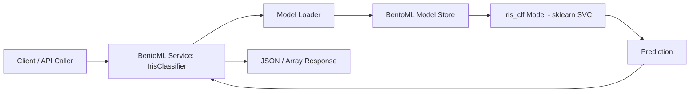
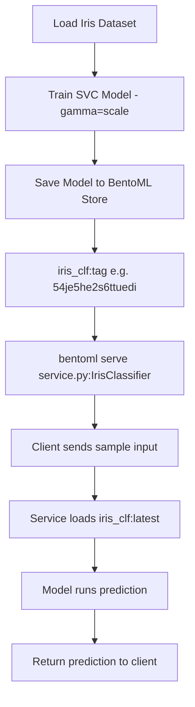
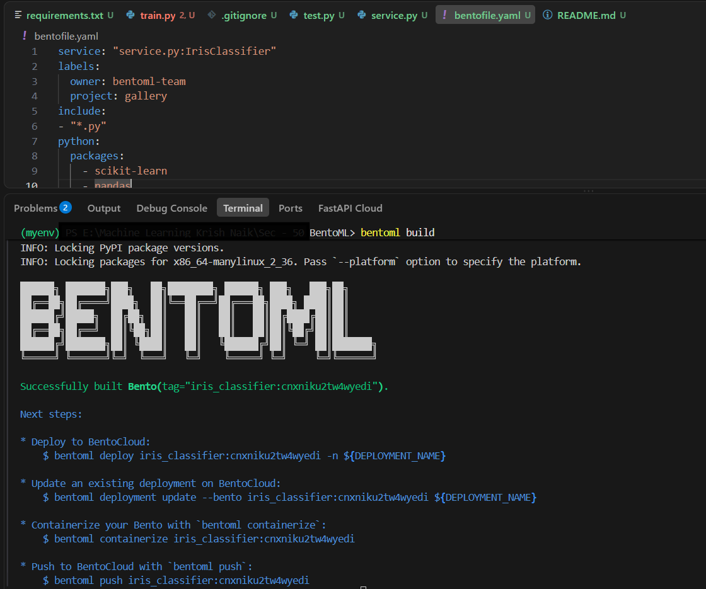

# Iris Classifier — BentoML Inference Service

A production-style machine learning inference service that serves a Support Vector Classifier trained on the classic Iris dataset, built and packaged with [BentoML](https://www.bentoml.com/). This project demonstrates a complete, minimal MLOps loop: train a model, register it in a model store, expose it behind a versioned API, and package it for deployment.

---

## Overview

This repository trains a `scikit-learn` Support Vector Classifier (SVC) on the Iris dataset and serves it through a BentoML service. BentoML handles model versioning, runtime serving, and bundling into a deployable artifact (a "Bento"), so the focus stays on a clean, reproducible inference path rather than infrastructure glue code.

The project is intentionally small in scope, but structured the way a real inference service would be: a training script that produces a versioned model artifact, a service layer that exposes that artifact over an API, and a build configuration that packages both for deployment.

## Problem Solved

Turning a trained scikit-learn model into something callable over an API involves more than `model.predict()`. It requires:

- A consistent way to **version and store** trained models
- A **service layer** that loads the right model version and exposes it safely
- A **repeatable build process** that bundles code, model, and dependencies together
- A path to **containerize and deploy** the service

This project solves that end-to-end for a simple classifier, using BentoML as the serving and packaging layer instead of hand-rolled Flask/FastAPI plumbing.

## Key Features

- 🧠 **Model training** on the canonical Iris dataset using `scikit-learn`'s `SVC`
- 📦 **Versioned model storage** via BentoML's local model store
- 🚀 **API-first serving** with a single, typed `classify` endpoint
- 🔁 **Reproducible builds** via `bentofile.yaml`
- 🧪 **Lightweight runtime testing** with a standalone test script
- 🐳 **Container-ready path** for deployment (via BentoML's `containerize` workflow / Docker)
- ☁️ **Published container image** on Docker Hub

## Tech Stack

| Layer | Technology |
|---|---|
| Model training | `scikit-learn` (`SVC`) |
| Model serving & packaging | `BentoML` 1.4.x |
| Runtime | Python 3 |
| Numerical I/O | `NumPy` |
| Containerization | Docker (via BentoML `containerize`) |
| Registry | Docker Hub |

---

## Project Architecture

At runtime, a client sends a feature vector to the BentoML service, which loads the trained model from BentoML's model store and returns a prediction.



## Model Lifecycle: Training → Inference Flow

The model lifecycle is split cleanly into an offline training phase and an online serving phase, connected by BentoML's model store.



---

## File Structure

```
.
├── service.py           # BentoML service definition and API endpoint
├── train.py              # Model training script (loads data, trains SVC, saves to model store)
├── test.py                # Lightweight local runner-based inference test
├── bentofile.yaml     # Bento build configuration (packaging metadata)
├── requirements.txt  # Python dependencies
├── dockerfile             # Reserved for containerization (see Docker section)
└── README.md
```

> Note: a local virtual environment folder (`myenv/`) may exist alongside the project for development purposes. It is not part of the project source and should not be committed to version control.

---

## Installation

### Prerequisites

- Python 3.9+
- `pip`

### Setup

```bash
# Clone the repository
git clone <your-repo-url>
cd <repo-name>

# Create and activate a virtual environment
python -m venv myenv
source myenv/bin/activate   # On Windows: myenv\Scripts\activate

# Install dependencies
pip install -r requirements.txt
```

`requirements.txt` includes:

```
bentoml==1.4.38
scikit-learn
```

---

## Training the Model

`train.py` loads the Iris dataset, trains an `SVC(gamma='scale')` classifier, and saves it into BentoML's local model store.

```bash
python train.py
```

On success, BentoML registers a new versioned model tag, for example:

```
Model(tag="iris_clf:54je5he2s6ttuedi")
```

Each training run produces a new, immutable version — `iris_clf:latest` always resolves to the most recent one.

---

## Serving the Model

Once a model has been trained and saved, start the BentoML service locally:

```bash
bentoml serve service.py:IrisClassifier --reload
```

This starts a local HTTP server that loads `iris_clf:latest` from the model store and exposes the `classify` endpoint. The `--reload` flag enables hot-reloading during development.

## Example Inference Request

The service accepts a NumPy-compatible array of feature values (sepal length, sepal width, petal length, petal width) and returns predicted class labels.

Using `curl`:

```bash
curl -X POST http://localhost:3000/classify \
  -H "Content-Type: application/json" \
  -d '{"features": [[5.9, 3.5, 5.1, 1.2]]}'
```

Using the BentoML Python client:

```python
import bentoml

with bentoml.SyncHTTPClient("http://localhost:3000") as client:
    result = client.classify(features=[[5.9, 3.5, 5.1, 1.2]])
    print(result)
```

## API Contract

**Service:** `IrisClassifier`
**Endpoint:** `classify`

| Field | Type | Description |
|---|---|---|
| Input | `np.ndarray` | 2D array of shape `(n_samples, 4)` — Iris feature vectors |
| Output | `np.ndarray` | 1D array of predicted class labels (`0`, `1`, or `2`) |

```python
@bentoml.api
def classify(self, features: np.ndarray) -> np.ndarray:
    prediction = iris_model.predict(features)
    return np.asarray(prediction)
```

---

## Deployment and Packaging with BentoML

The `bentofile.yaml` defines how the service, its Python dependencies, and metadata are bundled into a single deployable artifact (a "Bento"):

```yaml
service: "service.py:IrisClassifier"
labels:
  owner: bentoml-team
  project: gallery
include:
  - "*.py"
python:
  packages:
    - scikit-learn
    - pandas
```

To build a Bento:

```bash
bentoml build
```

A successful build produces a versioned Bento artifact, ready to containerize or push to a deployment target:



From there, BentoML supports several next steps directly from the CLI, including deploying to BentoCloud, containerizing the Bento, or pushing it to a registry.

## Docker / Containerization Notes

The `dockerfile` in this repository is currently a placeholder and is **not yet configured** — it is reserved for a future custom containerization step rather than an active build definition. In the meantime, this project has already been containerized and published using BentoML's built-in `containerize` workflow, which generates a production-ready image directly from the built Bento:

```bash
# Build the Bento
bentoml build

# Containerize it
bentoml containerize iris_classifier:<tag>

# Run the container
docker run -it --rm -p 3000:3000 iris_classifier:<tag> serve
```

The resulting image has been pushed to Docker Hub and is available here:

🔗 **[akshatkumarsingh/iris-bentoml-service](https://hub.docker.com/repository/docker/akshatkumarsingh/iris-bentoml-service/general)**

Once the custom `dockerfile` is filled in, it can be used as an alternative, hand-authored build path (e.g. for adding OS-level dependencies, non-Python tooling, or a custom base image) instead of relying solely on `bentoml containerize`.

---

## Testing

`test.py` provides a lightweight, local sanity check of the trained model using a BentoML runner, without needing the full HTTP service running:

```bash
python test.py
```

Internally, this:

1. Fetches the latest saved model: `bentoml.sklearn.get("iris_clf:latest")`
2. Wraps it in a runner: `.to_runner()`
3. Initializes it locally: `iris_clf_runner.init_local()`
4. Runs a sample prediction on `[[5.9, 3.5, 5.1, 1.2]]`

This is useful for quickly validating that a newly trained model behaves as expected before serving it.

## Example Output / Expected Behavior

For the sample input `[[5.9, 3.5, 5.1, 1.2]]`, the service returns a single-element array containing the predicted Iris class index (`0` = *setosa*, `1` = *versicolor*, `2` = *virginica*), for example:

```
[2]
```

## Troubleshooting / Common Issues

| Issue | Likely Cause | Fix |
|---|---|---|
| `BentoMLException: Model 'iris_clf:latest' not found` | `train.py` hasn't been run yet | Run `python train.py` before serving or testing |
| `bentoml serve` fails to start | Wrong entry point path | Confirm the command matches `service.py:IrisClassifier` |
| Predictions look wrong or stale | Serving an older model version | Re-run `train.py` to refresh `iris_clf:latest`, or pin an explicit tag |
| `bentoml build` fails on dependencies | Version mismatch between `requirements.txt` and `bentofile.yaml` | Keep both dependency lists in sync |
| Docker build does nothing | `dockerfile` is currently empty | Use `bentoml containerize` instead, or populate the `dockerfile` first |

## Future Enhancements

- Populate the `dockerfile` for a fully custom container build path
- Add input validation and schema enforcement (e.g. via Pydantic) on the `classify` endpoint
- Add CI to automatically train, test, and build a Bento on push
- Add batch prediction support and probability outputs (`predict_proba`)
- Deploy to BentoCloud or a Kubernetes target for a live, public-facing endpoint
- Add monitoring/logging around prediction latency and input drift

---

## Conclusion

This project is a compact but complete reference for turning a scikit-learn model into a versioned, servable, and packageable inference service using BentoML. It covers the full loop — train, store, serve, test, and containerize — in a way that mirrors how production ML services are structured, while staying small enough to read end-to-end in a few minutes.